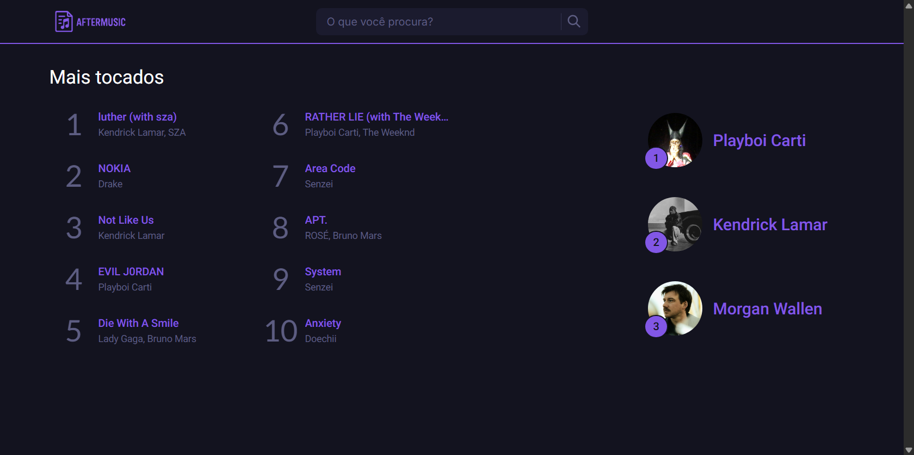

# <h1 align="center">AFTERMUSIC</h1>
<p align="center" style="font-size:18px">A web application to explore songs, artists, and albums with real-time data from the Spotify API.</p>
<p align="center">
  
  <br>
  <em>Caption: home page.</em>
</p>
<p align="center">
  <a href="https://github.com/ViniMPDS11/aftermusic/blob/main/LICENSE"></a>
  
  
  
</p>

## 📌 Topics

<ol class="summary">
  <li><a href="#about-the-project">About the Project</a></li>
      <ol>
      <li><a href="#objectives">Objectives</a></li>
      <li><a href="#why-this-project">Why this project?</a></li>
    </ol>
  <li><a href="#features">Features</a></li>
  <li><a href="#project-architecture">Project Architecture</a>
    <ol>
      <li><a href="#folder-structure">Folder Structure</a></li>
      <li><a href="#frontend-and-backend-separation">Frontend and Backend Separation</a></li>
    </ol>
  </li>
  <li><a href="#frontend">Frontend</a>
    <ol>
      <li><a href="#frontend-technologies-used">Technologies Used</a></li>
      <li><a href="#frontend-file-structure">File Structure</a></li>
      <li><a href="#frontend-responsiveness">Responsiveness</a></li>
      <li><a href="#frontend-main-components">Main Components</a></li>
      <li><a href="#frontend-style-and-layout">Style and Layout</a></li>
        <ol>
            <li><a href="#frontend-desktop-layout">Desktop Layout</a></li>
            <li><a href="#frontend-mobile-layout">Mobile Layout</a></li>
        </ol>
    </ol>
  </li>
  <li><a href="#backend">Backend</a>
    <ol>
      <li><a href="#backend-technologies-used">Technologies Used</a></li>
      <li><a href="#environment-configuration">Environment Configuration (.env)</a></li>
      <li><a href="#spotify-api-requests">Spotify API Requests</a></li>
      <li><a href="#lyrics-integration">Lyrics Integration (Lrclib)</a></li>
      <li><a href="#backend-data-flow">Data Flow</a></li>
    </ol>
  </li>
  <li><a href="#api-routes">API Routes</a>
    <ol>
      <li><a href="#get-search-trackid">GET /search-track/:id</a></li>
      <li><a href="#get-search-artistid">GET /search-artist/:id</a></li>
      <li><a href="#get-get-track-and-artistsearch">GET /get-track-and-artist/:search?</a></li>
      <li><a href="#get-get-top-tracks">GET /get-top-tracks</a></li>
      <li><a href="#get-get-top-artists">GET /get-top-artists?quant=</a></li>
      <li><a href="#get-get-top-tracks-from-artistid">GET /get-top-tracks-from-artist/:id</a></li>
      <li><a href="#get-get-albums-from-artistid">GET /get-albums-from-artist/:id</a></li>
      <li><a href="#get-get-info-from-albumid">GET /get-info-from-album/:id</a></li>
      <li><a href="#get-get-letterartisttrack">GET /get-letter/:artist/:track</a></li>
      <li><a href="#get-discographyid">GET /discography/:id</a></li>
    </ol>
  </li>
  <li><a href="#how-to-run-the-project">How to Run the Project</a>
    <ol>
      <li><a href="#prerequisites">Prerequisites</a></li>
        <ol>
          <li><a href="#installing-nodejs">Installing Node.js</a></li>
          <li><a href="#spotify-credentials">Getting Spotify Credentials</a></li>
          <li><a href="#installing-git">Installing Git (optional)</a></li>
        </ol>
      <li><a href="#installation">Installation</a></li>
      <li><a href="#running-the-backend">Running the Backend</a></li>
    </ol>
  </li>
  <li><a href="#contribution">Contribution</a></li>
  <li><a href="#author">Author</a></li>
  <li><a href="#license">License</a></li>
</ol>

## <h2 id="about-the-project">📌 About the Project</h2>

This project is a web application that interacts with the [Spotify Web API](https://developer.spotify.com/documentation/web-api/) to provide users with an intuitive and visually appealing interface to:

- Search for **artists**, **tracks**, and **albums**
- View the **top tracks** and **most mentioned artists** in a global top playlist
- Explore an artist’s **discography**, including top tracks and album details
- Access **lyrics** for a given track using the [Lrclib API](https://lrclib.net/)

The main goal of this application is to create a **personalized musical discovery experience**, making it easier to explore artists' work in a central, elegant, and responsive platform. It was developed with a strong focus on **UI/UX**, **code organization**, and **API integration**.

### <h3 id="objectives">🎯 Objectives</h3>

- Learn and practice **RESTful API integration** with authentication (OAuth 2.0 - Client Credentials Flow)
- Develop a project using **Node.js (Express)** for the backend and **Vanilla JavaScript** for the frontend
- Apply **modular architecture** to keep frontend and backend well-separated
- Practice the use of **async/await**, **error handling**, and **API consumption**
- Deliver a smooth and responsive **user experience** across a variety of screen sizes

### <h3 id="why-this-project">💡 Why this project?</h3>

With Spotify being one of the most used music platforms in the world, this project was a great opportunity to:

- Explore real-world APIs
- Improve asynchronous JavaScript skills
- Combine design and development into a cohesive project
- Build a portfolio-ready app that showcases both frontend and backend abilities

## <h2 id="features">🚀 Features</h2>

### <h3 id="music-and-artist-search">🎵 Music and Artist Search</h3>
- Search for songs, artists, and albums by typing in the query.
- Retrieves data from Spotify and displays results with image, name, and additional info.

### <h3 id="top-tracks-from-playlist">🔥 Top Tracks from a Playlist</h3>
- Displays the most played tracks from a global top playlist.

### <h3 id="artist-details">👨‍🎤 Artist Details</h3>
- Fetches detailed artist information such as popularity, followers, and image.
- Also shows the artist’s most popular songs and albums.

### <h3 id="artist-discography">💿 Artist Discography</h3>
- Displays all released albums and related albums by a selected artist.
- Supports pagination (limit and offset parameters).

### <h3 id="album-details">📀 Album Details</h3>
- Fetches and displays complete information about a selected album:
  - Name, release date, number of tracks, cover image, and track list.

### <h3 id="track-details">🎧 Track Details</h3>
- Shows information about a specific song, including:
  - Album name and audio preview (if available).

### <h3 id="lyrics-search">📝 Lyrics Search</h3>
- Searches for lyrics using the [Lrclib API](https://lrclib.net/).
- Displays lyrics if available for the searched artist and track.

## <h2 id="project-architecture">🧱 Project Architecture</h2>

The project is structured with a separation between frontend and backend. Each part is contained in its respective folder to improve maintainability and scalability.

### <h3 id="frontend-and-backend-separation">🔗 Frontend and Backend Separation</h3>

The project follows a **separation of concerns** principle:

- **Frontend**:
  - Built using plain HTML, CSS, and JavaScript.
  - Communicates with the backend through `fetch` API calls.
  - Contains no server-side logic — purely for displaying data and handling user interaction.

- **Backend**:
  - Built with **Node.js**, **Express**, and **dotenv**.
  - Manages API requests to the Spotify API.
  - Provides REST endpoints for the frontend to fetch music, artists, albums, and lyrics.

## <h2 id="frontend">🎨 Frontend</h2>
The frontend was developed using HTML, CSS, and vanilla JavaScript, aiming for a clean, responsive, and intuitive user interface. It consumes data from a custom Node.js and Express API, displaying music-related content such as tracks, artists, and albums from Spotify.

### <h3 id="frontend-technologies-used">🛠️ Technologies Used</h3>
- [HTML5](https://html.spec.whatwg.org/) – Page structure

- [CSS3](https://www.w3.org/Style/CSS/Overview.en.html) – Styling and layout

- [Vanilla JavaScript](https://developer.mozilla.org/pt-BR/docs/Web/JavaScript) – Client-side logic and interactivity

- [Fetch API](https://developer.mozilla.org/pt-BR/docs/Web/API/Fetch_API) – HTTP requests to backend endpoints

### <h3 id="frontend-responsiveness">📱 Responsiveness</h3>

- The entire application is fully responsive, adapting smoothly to different screen sizes.  
- On desktop, all content is visible and well-organized using a clean and intuitive layout.  
- On mobile devices, some interface elements are optimized for better usability—for example, the search bar in the header is replaced with a search button that opens a modal containing the search input field.  
- This ensures a seamless user experience across smartphones, tablets, and desktops.

### <h3 id="frontend-main-components">🧩 Main Components</h3>

The application consists of multiple specialized pages that work together to provide a comprehensive music exploration experience:

- **Header (All Pages):** Includes a logo that links to the homepage and a search bar (or search modal on mobile).
- **Homepage (`index.html`):** Displays the global top 10 tracks and top 3 most-featured artists.
- **Album Page (`album.html`):** Lists all tracks from a specific album, displays album cover and total track count.
- **Artist Page (`artist.html`):** Shows artist image, name, follower count, top 10 tracks, and 6 albums with a button linking to the artist’s discography page.
- **Discography Page (`discography.html`):** Lists all albums from the artist with pagination, along with their profile info.
- **Search Page (`search-artists-and-tracks.html`):** Displays best match and lists of matching tracks, artists, and albums based on the user’s search.
- **Track Page (`track.html`):** Shows song title, artist info, lyrics, an album card with release date (linking to album page), and a Spotify player that allows full playback if the user is logged in.

### <h3 id="frontend-style-and-layout">🎨 Style and Layout</h3>

- The site features a clean, modern design with a dark interface.  
- It makes use of custom HTML and CSS to maintain consistency across all pages.  
- SVG icons and visually appealing components are used to enhance the user experience.  
- The layout uses proper spacing, alignment, and responsive grids to present content clearly.  
- The navigation and interactive elements are built for clarity and ease of use, especially on mobile.

#### <h4 id="frontend-desktop-layout">🖥️ Desktop Layout</h4>

<p align="center">
    
    <br>
    <em>Caption: AfterMusic desktop version.</em>
</p>

#### <h4 id="frontend-mobile-layout">📱 Mobile Layout</h4>

<p class="mobile-gallery" align="center">
    
    <br>
    <em>Caption: mobile version of AfterMusic.</em>
</p>

## <h2 id="backend">🧠 Backend</h2>

The backend of this project was built using **Node.js** and **Express**. It is responsible for communicating with external APIs (Spotify and Lrclib), handling data processing and delivering structured data to the frontend.

---

### <h3 id="backend-technologies-used">🛠️ Technologies Used</h3>

- [Node.js](https://nodejs.org/en/docs) – JavaScript runtime environment for building server-side logic.
- [Express](https://expressjs.com) – Minimal and flexible web application framework.
- [Dotenv](https://github.com/motdotla/dotenv) – Loads environment variables from a `.env` file.
- [CORS](https://www.npmjs.com/package/cors) – Enables Cross-Origin Resource Sharing.
- [Node-fetch](https://github.com/node-fetch/node-fetch) – A fetch implementation for Node.js to make HTTP requests.

---

### <h3 id="environment-configuration">⚙️ Environment Configuration (.env)</h3>

Sensitive keys and configurations are stored in a `.env` file.

Example:

```.env
PORT=3000
CLIENT_ID=your_spotify_client_id
CLIENT_SECRET=your_spotify_client_secret
```
> ⚠️ Never expose your .env file in version control systems.

### <h3 id="spotify-api-requests">🎧 Spotify API Requests</h3>
The backend uses the [Spotify Web API](https://developer.spotify.com/documentation/web-api) with **Client Credentials Flow** to retrieve an access token and make the following requests:

- **Artist's Top Tracks** – `/top-tracks`

- **Top Artists (Global)** – `/top-artists`

- **Artist Details** – `/artist/:id`
Includes artist photo, name, follower count, top 10 tracks, and 6 most recent albums.

- **Album Details** – `/album/:id`
Includes album cover, track count, and full tracklist.

- **Artist Albums** – `/artists/:id/albums`
Includes album cover and track count.

- **Track Details** – `/track/:id`
Includes artist name, song title, preview, lyrics, and album data.

- **Search** – `/search?q=your_query`
Returns list of tracks, artists, and albums matching the query.

### <h3 id="lyrics-integration">📝 Lyrics Integration (Lrclib)</h3>
The backend connects to the [Lrclib API](https://lrclib.net/) to fetch song lyrics dynamically.

- For each track request, it searches for lyrics using the artist name and song title.

- If lyrics are found, they're returned and shown on the `track.html` page.

- If lyrics are not found, a fallback message is provided to the frontend.

This adds value by enhancing the user's experience with lyrics.

### <h3 id="backend-data-flow">🔄 Data Flow</h3>
<ol>
  <li>The frontend sends a request to an Express route.</li>

  <li>The backend authenticates with the Spotify API (if needed).</li>

  <li>It fetches and structures the data.</li>

  <li>The backend returns a clean, formatted JSON response to the frontend.</li>
</ol>

This abstraction ensures that the frontend never directly interacts with the external APIs.

## <h2 id="api-routes">🧪 API Routes</h2>
These are the backend routes that serve structured JSON data to the frontend. Each endpoint is optimized for clarity and performance.

### <h3 id="get-search-trackid">🔍 GET `/search-track/:id`</h3>
Returns detailed information for a specific track using its Spotify `id`.  
Includes: track name, artist, album and preview.

### <h3 id="get-search-artistid">🔍 GET `/search-artist/:id`</h3>
Fetches detailed information about an artist using their Spotify `id`.  
Includes: name, image, followers, genres, and popularity.

### <h3 id="get-get-track-and-artistsearch">🔍 GET `/get-track-and-artist/:search?`</h3>
Performs a general search based on the user query.  
Returns top-matching tracks, artists, and albums.

### <h3 id="get-get-top-tracks">🔥 GET `/get-top-tracks`</h3>
Returns the top 50 most popular tracks globally from Spotify.

### <h3 id="get-get-top-artists">🔥 GET `/get-top-artists?quant=`</h3>
Returns a list of the most popular artists.  
You can control the quantity with the `quant` query parameter.

### <h3 id="get-get-top-tracks-from-artistid">🎤 GET `/get-top-tracks-from-artist/:id`</h3>
Returns the top 10 most played tracks of a specific artist by their `id`.

### <h3 id="get-get-albums-from-artistid">💿 GET `/get-albums-from-artist/:id`</h3>
Returns all albums from a specific artist using their `id`.

### <h3 id="get-get-info-from-albumid">💿 GET `/get-info-from-album/:id`</h3>
Fetches data for a specific album using its `id`.  
Includes: cover image, name, release date, and full tracklist.

### <h3 id="get-get-letterartisttrack">📝 GET `/get-letter/:artist/:track`</h3>
Connects to the Lrclib API to fetch lyrics by track and artist name.

### <h3 id="get-discographyid">📚 GET `/discography/:id`</h3>
Returns the full paginated discography of an artist using their Spotify `id`.

## <h2 id="how-to-run-the-project">🚀 How to Run the Project</h2>

### <h3 id="prerequisites">📦 Prerequisites</h3>

#### <h4 id="installing-nodejs">🔧 Installing Node.js</h4>
- Go to the official website: <a href="https://nodejs.org" target="_blank">https://nodejs.org</a>  
- Download the LTS version for your operating system  
- Follow the installation steps provided in the installer  
- After installation, open your terminal and run `node -v` and `npm -v` to confirm the installation

#### <h4 id="spotify-credentials">🔑 Getting Spotify Credentials</h4>
To access the Spotify Web API, you’ll need a `Client_ID` and `Client_Secret`.

1. Go to the Spotify Developer Dashboard: <a href="https://developer.spotify.com/dashboard" target="_blank">https://developer.spotify.com/dashboard</a>
2. Log in with your Spotify account  
3. Click on **"Create an App"** and fill in the required fields (name and description)  
4. After creating the app, you will see your `Client ID` and `Client Secret`  
5. Save your credentials in a safe place

#### <h4 id="installing-git">🌳 Installing Git (optional)</h4>
If you don't have Git yet:
1. Download it from: https://git-scm.com
2. Install with default settings.

### <h3 id="installation">📁 Installation</h3>
1. Open your terminal (or Git Bash on Windows)
2. Clone this repository with the following commands:
``` Bash
# Go to the folder where you want to save the repository, for example:
$ cd path/to/your/folder

# clone
$ git clone https://github.com/ViniMPDS11/aftermusic.git

# open project
$ cd aftermusic

# install dependencies
$ npm install
```

### <h3 id="running-the-backend">🧠 Running the Backend</h3>
1. Navigate to the backend directory  
2. Create a `.env` file and add your credentials that you obtained earlier:  
```.env
PORT=3000
CLIENT_ID=your_spotify_client_id
CLIENT_SECRET=your_spotify_client_secret
``` 
3. Start the server with:  
`npm start` or `npm run dev` (if using nodemon)

## <h2 id="contribution">🤝 Contribution</h2>

To collaborate with the project, you need to create a `FORK` with your Git account, after that, follow the commands in your directory:

``` bash
# Cloning project
$ git clone https://github.com/YOUR-USER/aftermusic.git

# Creating a branh
$ git branch my-change

# Accessing the new branch
$ git checkout -b my-change

# Adding changed files
$ git add .

# Creating commit and message
$ git commit -m "Your Commit..."

# Submitting changes to branch
$ git push origin my-change
```

Now you should just go to your repository created on Github and click on the `New pull request` button.

## <h2 id="license">👤 Author</h2>

Made by [ViniMPDS11](https://github.com/ViniMPDS11).

## <h2 id="license">📄 License</h2>

This project is licensed under the **MIT License**.  
You are free to use, copy, modify, and distribute this project for personal or commercial purposes, as long as you include the original copyright.